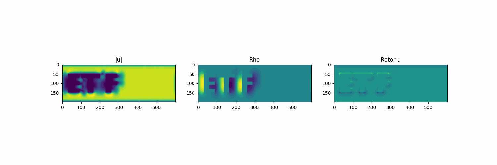
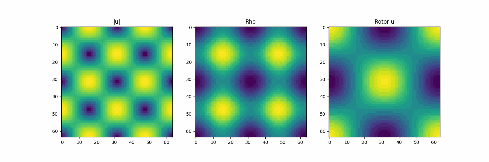
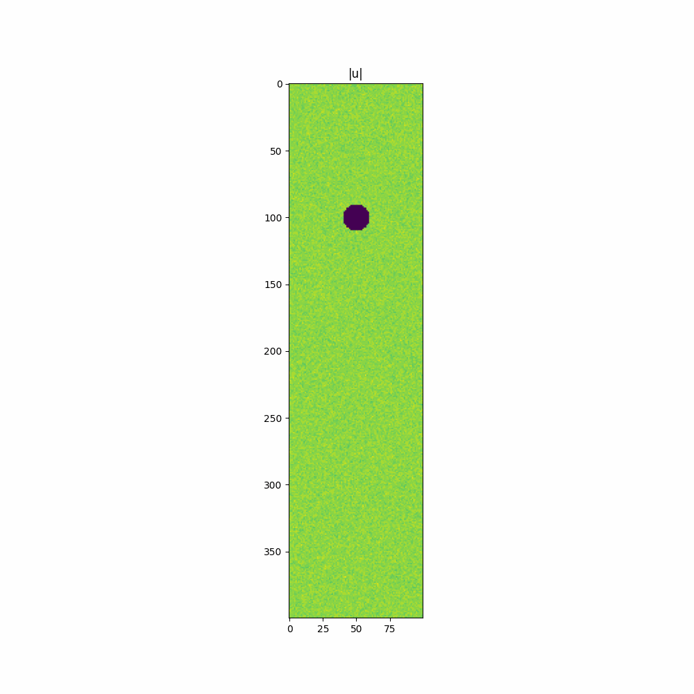

# Lattice Boltzmann Simulation (2D & 3D)

This repository contains the source code and simulation results from the paper "Simulacija protoka fluida pri prisustvu čvrstih tijela". 
It implements a Lattice Boltzmann Method (LBM) solver to simulate incompressible fluid flow in both 2D and 3D geometries.

The files `lbm2d.py` and `lbm3d.py` include the implementation of the LBM solver.

For examples refer to the files: `etf.py`, `taylorgreen.py`, `sphere.py`, `gravity.py`, `circle.py`, `olympic.py`

### Fluid flow around the letters ETF

### Taylor Green vortex simulation

### A slice of a 3d simulation of flow over a sphere

